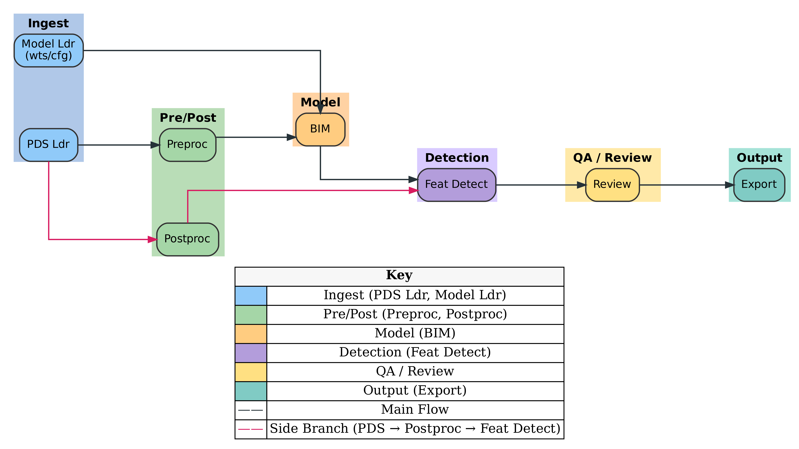

# Adding a new module

## Poetry testing setup commands
```
cd packages\bennu-feature-extractor-***
poetry env list --full-path
poetry env remove --all
poetry config virtualenvs.in-project true
if (Test-Path .\python) { Rename-Item .\python _python_OLD }
py -3.13 --version
poetry env use 3.13
poetry lock
poetry install -v
```

## Run the following commands
```
pip install pigar (When opened the poetry venv)
pigar generate -f requirements.txt
Get-Content requirements.txt | ForEach-Object { poetry add $_ }
```

# V1.1 (block 1) project structure



# AO33 – Unsupervised Boulder Mapping of Asteroid (101955) Bennu

## Project Overview  
In 2018, NASA’s **OSIRIS-REx** mission arrived at near-Earth Asteroid **Bennu** and carried out a detailed survey before collecting a sample in October 2020, finally returning it to Earth in September 2023.  

During the survey, the mission collected:  
- Surface imagery  
- Detailed 3D topography using LIDAR  
- Visible, near, and thermal infrared spectra  

The **Planetary Experiments Group in Oxford Physics** has been part of the mission team throughout. The group is now working to connect infrared spectroscopic measurements of the returned sample (measured in the lab) to the global measurements of Bennu made by the spacecraft.  

This project focuses on characterising the surface topography of Bennu to help us understand its infrared spectra and returned samples.  

---

## Project Goals  
The student will develop a **machine-learning pipeline** that:  
1. Automatically segments individual boulders using remote sensing data from the asteroid.  
2. Clusters them into **textural families**.  
3. Extracts their **size-frequency distribution (SFD)**.  

---

## Specific Objectives  
1. **Produce the first automated Bennu boulder catalogue** (≥100,000 objects) including:  
   - Diameters  
   - Shapes  
   - Albedo/colour indices  
   - Local roughness metrics  

2. **Quantify how SFD and block packing vary** between the unsupervised boulder classes, testing hypotheses about porosity and strength suggested by *Rozitis et al. 2022*.  

3. **Correlate class-specific SFD parameters** (cumulative slope, maximum block size) with thermal inertia and spectral slope to determine whether mechanical breakdown pathways drive observed variability.  

---

## Skills & Background  
This project would suit a student with:  
- Programming experience (Python or MATLAB preferred)  
- Interest in **Solar System / planetary science**  
- Interest in **autonomous classification systems** (e.g., neural networks or other machine learning techniques)  

---

## Background Reading  

### OSIRIS-REx Mission  
- [Background information on OSIRIS-REx](https://link.springer.com/article/10.1007/s11214-017-0405-1)  

### Sample Sites  
- [Emery paper on sample sites](https://www.sciencedirect.com/science/article/pii/S0019103514000827?casa_token=TMH2QNtCpY8AAAAA:kZMozTSPqCTd_o7mZ-B6i6h8GAXgPFMzAZE5o-wSoGB9-lms2D8FrKWZpnrk9hGo9qostnSunA)  

### Digital Mapping Approaches  
- [Current digital mapping approaches #1](https://www.sciencedirect.com/science/article/pii/S0032063318303805?casa_token=o2i3SQLUJmIAAAAA:qzAnL-RhVa_Yz8MFSsqccVYna1QTJOxJdpRgpvvQekRU8bvYJukhwDGwl76yCI7YJutkJ-4beA)  
- [Current digital mapping approaches #2](https://agupubs.onlinelibrary.wiley.com/doi/full/10.1029/2018EA000382)  

### Boulder Properties  
- [Boulder properties](https://agupubs.onlinelibrary.wiley.com/doi/full/10.1029/2023JE008019)  

### Other Planetary Boulder Mapping Efforts  
- [Comparative planetary boulder mapping](https://agupubs.onlinelibrary.wiley.com/doi/full/10.1029/2023JE008013)  

### Citations
For all of the download likes the data source will need to be cited
